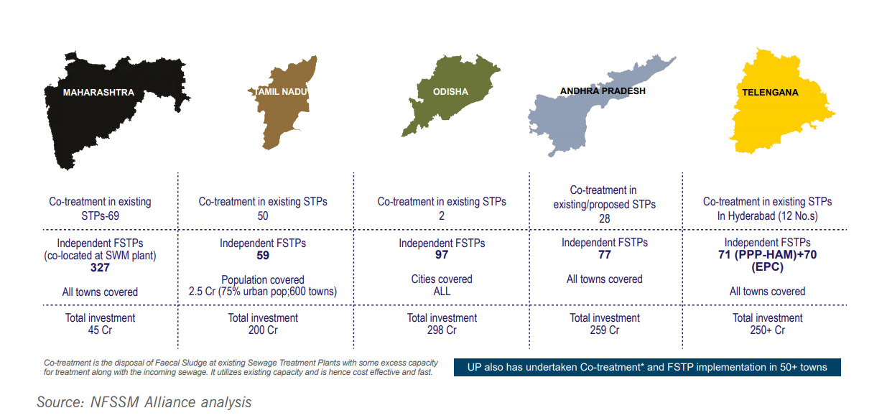
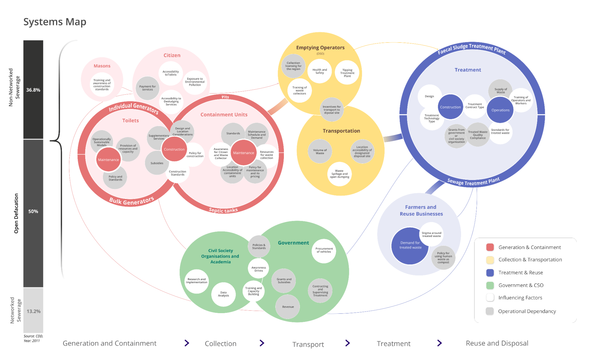
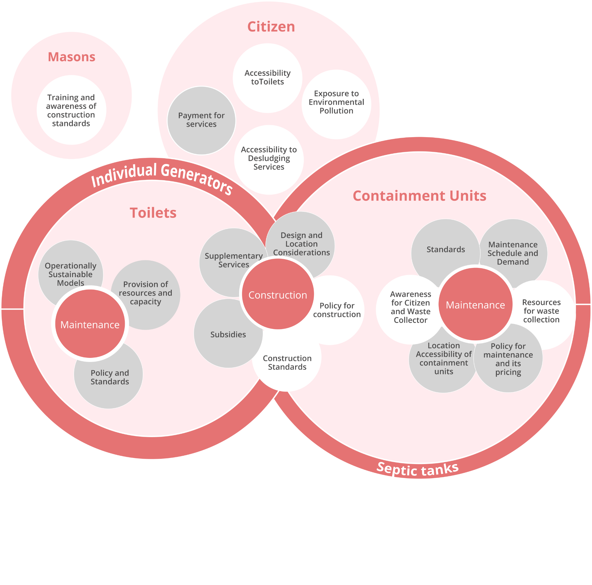
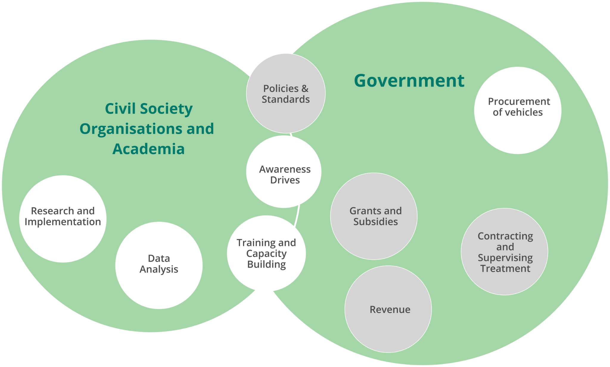

# Concept Note

Table of Contents

1. Glossary
2. Background and Landscape
   * What is Sanitation?
   * Why Sanitation matters?
   * Current State of Sanitation Systems in India
   * Systemic Challenges in FSSM
   * Pivotal Problems
3. Mission - Envisioning a new way of Sanitation
   * Introduction
   * Addressing Pivotal Problems
   * Mission Outcomes
4. DISHHA - Digital Infrastructure for Sanitation & Healthy Habitats
   * Introduction
   * Platform Principles
   * Building Blocks
   * DISHHA - High-Level Component View
   * Success for Platform
5. Benefits for the Ecosystem
6. Operationalizing the mission
   * Sanitation Mission Timeline

## Glossary

<table>
  <thead>
    <tr>
      <th style="text-align:left">ADB</th>
      <th style="text-align:left">Asian Development Bank</th>
    </tr>
  </thead>
  <tbody>
    <tr>
      <td style="text-align:left">AMRUT</td>
      <td style="text-align:left">Atal Mission for Rejuvenation and Urban Transformation</td>
    </tr>
    <tr>
      <td style="text-align:left">CDD</td>
      <td style="text-align:left">Consortium for DEWATS Dissemination Society</td>
    </tr>
    <tr>
      <td style="text-align:left">FICCI</td>
      <td style="text-align:left">Federation of Indian Chambers of Commerce &amp; Industry</td>
    </tr>
    <tr>
      <td style="text-align:left">FS</td>
      <td style="text-align:left">Faecal Sludge</td>
    </tr>
    <tr>
      <td style="text-align:left">FSM</td>
      <td style="text-align:left">Faecal Sludge Management</td>
    </tr>
    <tr>
      <td style="text-align:left">FSSM</td>
      <td style="text-align:left">Faecal Sludge and Septage Management</td>
    </tr>
    <tr>
      <td style="text-align:left">NMCG</td>
      <td style="text-align:left">National Mission for Clean Ganga</td>
    </tr>
    <tr>
      <td style="text-align:left">SBM</td>
      <td style="text-align:left">Swachh Bharat Mission</td>
    </tr>
    <tr>
      <td style="text-align:left">SBM-U</td>
      <td style="text-align:left">Swachh Bharat Urban</td>
    </tr>
    <tr>
      <td style="text-align:left">SBM 2.0</td>
      <td style="text-align:left">Swachh Bharat Mission 2.0</td>
    </tr>
    <tr>
      <td style="text-align:left">USAID</td>
      <td style="text-align:left">United States Agency for International Development</td>
    </tr>
    <tr>
      <td style="text-align:left">SWM</td>
      <td style="text-align:left">Solid Waste Management</td>
    </tr>
    <tr>
      <td style="text-align:left">Platform
         (and Platform Architecture)</td>
      <td style="text-align:left">In the context of eGov, a platform refers specifically to an open digital
        platform. This is a collection of software components (&#x201C;building
        blocks&#x201D;), which are created as microservices and interact through
        the use of APIs. A complex software system, which can perform multiple
        functions, is deconstructed into a digital platform by following the principle
        of unbundling. &#x201C;Platform architecture&#x201D; is an abstract description
        of the components of a digital platform and how they are related to each
        other.</td>
    </tr>
    <tr>
      <td style="text-align:left">Building Block</td>
      <td style="text-align:left">Refers to the various software components that make up the platform</td>
    </tr>
    <tr>
      <td style="text-align:left">Solution (and Reference Solution)</td>
      <td style="text-align:left">
        
In the context of eGov, solutions will take the form of a software application;
          such applications are said to run &#x201C;on top of&#x201D; a platform,
          leveraging the various microservices and capabilities provided by the platform.

        
DISHHA will include certain &#x201C;reference solutions&#x201D;, which
          are intended to illustrate to the ecosystem how such solutions/applications
          could function. A reference solution may not be directly used, but can
          form the basis for an actual operational solution with relatively little
          effort.

      </td>
    </tr>
    <tr>
      <td style="text-align:left">Program</td>
      <td style="text-align:left">
        
A program is an initiative undertaken by a given actor or group of actors
          to achieve a defined mission or goal. A program can have multiple activities,
          outputs, and outcomes which it pursues as part of its mission.

        
For programs created in the context of DISHHA, one of these outcomes will
          be the creation of open digital platforms or their building blocks. While
          such work will tend to take place at a central level, these platforms and
          programs can further support the establishment of state-level programs
          that adopt and align with the mission or goals of the central-level program.

      </td>
    </tr>
    <tr>
      <td style="text-align:left">Enablement / Enable</td>
      <td style="text-align:left">The words &#x201C;Enablement&#x201D; and &#x201C;Enable&#x201D; refer
        to the provision of training, knowledge transfer, and access to resources
        that improve the capacity of a partner to implement the platform</td>
    </tr>
  </tbody>
</table>

## Background and Landscape

###  What is Sanitation?

National Urban Sanitation Policy \(NUSP, 2008\) defines Sanitation as “safe management of human excreta, including safe confinement treatment, disposal, and associated hygiene-related practices”. While the policy pertains to human excreta, it recognizes that integral solutions need to take account of other elements of environmental sanitation, i.e. solid waste management; generation of industrial and other hazardous wastes; drainage; as also the management of drinking water supply.\[[1](http://mohua.gov.in/upload/uploadfiles/files/NUSP_0.pdf)\]

###  Why Sanitation Matters? 

_“_Everyone has the right to life, liberty, and security of person”; Article 21: the fundamental right to life in the Indian constitution embodies the same spirit as the Universal Declaration of Human Rights. If life and the prospect of a healthy and secure life is actually a right of every human being, then lack of safe sanitation is a barrier in achieving this goal. Every year three lakh Indian children die due to Diarrhoea, a preventable disease that happens due to contamination in food and water\[[1](https://www.ncbi.nlm.nih.gov/pmc/articles/PMC4367049/#ref2)\]. The same disease is behind the stunted growth of 4 crore Indian children\[[2](https://www.unicef.org/india/what-we-do/stop-stunting)\]. A lack of safe sanitation is attributed as a major cause of both, Diarrhoea and Stunting. Poor sanitation denies our fellow citizens the right to clean drinking water. Around 80% of India’s water is severely polluted because people dump raw sewage, silt, and garbage into the country’s rivers and lakes. The water is undrinkable and people rely on illegal and expensive sources of water. [\[3\]](https://www.borgenmagazine.com/water-pollution-in-india/) While our constitution embraces that “All human beings are born free and equal in dignity and rights”, poor sanitation disproportionately impacts vulnerable communities.

A John Hopkins Study \[[3](https://papers.ssrn.com/sol3/papers.cfm?abstract_id=2753358)\] highlights that the deficits in sanitation and the health burden on children is higher in more vulnerable slums. More than a third of households in the lowest income category lack access to any form of safe sanitation\[[4](https://journals.sagepub.com/doi/full/10.1177/0956247814567058)\], and it is not just the case at home. In public institutions, especially in schools, the lack of sanitation facilities burdens the girl child disproportionately once menstrual hygiene becomes a daily concern.\[[5](https://www.downtoearth.org.in/blog/health/23-girls-drop-out-of-school-on-reaching-puberty-59496)\].

The other key problem is working conditions and safety of sanitation workers According to the numbers collated by the National Commission for Safai Karamcharis \(NCSK\)\[[6](https://indianexpress.com/article/india/official-data-shows-one-manual-scavenging-death-every-five-days-5361531/)\], a sanitation worker dies every five days, on the job, cleaning sewers and septic tanks across the country. Article 5 of the universal declaration of human rights reads that “No one shall be subjected to torture or to cruel, inhuman or degrading treatment or punishment”, but the constant threat of death mark the life of sanitation workers who work under inhuman and unsafe conditions without personal protection or medical support. Forced by abject poverty and social exclusion, they have no other choice. The ground realities of Sanitation in India force us to examine our respect and concern for human life and dignity. It is no wonder that the man who devoted his entire life to independence, held Sanitation as more important.

### Current State of Sanitation Systems in India

The Ministry of Environment, Forest, and Climate Change defines hazardous waste as any waste which due to its physical, chemical, or biological composition is likely to harm health or the environment. By this definition, Human fecal matter is extremely hazardous, the evidence speaks for itself. The high volume and frequency of faecal matter generation, when seen against the current performance of our sanitation system, highlight the urgency of the issue. India ranks 107 out of 143 countries in terms of wastewater treatment according to the estimates of Yale University. [\[7\]](https://epi.yale.edu/epi-indicator-report/WWT)

According to gross estimates of the Indian Central Pollution Control Board, our cities generate 72.4 billion litres of sewage every day, of which only 20 billion is treated. It means that every single day, 52.2 billion litres of raw, untreated sewage goes out into the environment.[\[8\]](https://cpcb.nic.in/openpdffile.php?id=UmVwb3J0RmlsZXMvMTIyOF8xNjE1MTk2MzIyX21lZGlhcGhvdG85NTY0LnBkZg==) The sewage leeches into the soil, contaminates food and groundwater, causing pollution and deaths.

F most of the toilets in the country are not connected to an underground sewage network. Only 50% of the population used toilets in 2011, and 75% of these toilets were connected to an on-site pit or septic tank where the fecal matter remains contained for 3 to 5 years. These on-site systems are not properly managed, close to 70% of fecal matter ends up contaminating the environment due to poor construction and/or disposal practices. An analysis of Census 2011 shows that overall 93% of faecal matter entered the environment without treatment.

#### 

What is FSSM?

  

The waste we flush down the toilet does not always go into a sewer. Approximately 70% of the households in India have toilets connected to septic tanks or soak pits[\[8\]](https://smartnet.niua.org/sites/default/files/resources/feacal_sludge_menagement_leaf.pdf) , technically known as on-site containment systems. They accumulate and store faecal matter over a long period. In sewers, the fecal matter travels daily with a lot of water through long concrete pipes. But in the case of on-site systems, it stays stored for about 3-5 years. Once the storage is full, the waste is emptied and transported to the treatment plant through vacuum trucks. The end-to-end value chain of safe storage, collection, transport, treatment, and end-use or disposal of faecal matter is called Fecal Sludge and Septage management or FSSM. ‘Faecal Sludge’ and ’Septage’ are used to describe faecal matter in a specific physical and chemical  
state after prolonged storage.

#### Why does FSSM matter - It is the way forward in Sanitation

  
FSSM has emerged as a cost-efficient population scale alternative to the networked sewer, which has been the traditional method of wastewater management.  

1. **Cost-effective:** 10 times cheaper than sewer systems. Given the fiscal space for sanitation, FSSM becomes a default method for delivering safe sanitation for all.
2. **Coverage:** Less than one-third of urban toilet users are connected to sewer systems. The rest are more or less dependent on FSSM systems. Targeting FSSM will help us impact the maximum number of citizens.
3. **Scale:** In the Swachh Bharat Mission, GoI zeroed down on Open Defecation and constructed 11 crore toilets across the country, most of which are connected to on-site systems, again increasing the need for FSSM.
4. **Policy tail-winds:** From 2013 to 2021, the Government of India has shown consistent commitment evidenced to Sanitation. Over these years, state governments and union ministries have deeply engaged with domain experts to create several policy enablers in order to accelerate the progress of Sanitation outcomes. With the launch of the Swachh Bharat Mission in 2013, Sanitation came to the forefront of multiple policy interventions including dedicated funding for toilet construction, the proliferation of standards, service-level benchmarks, and Swacchh Survekshan. This was followed by a pivot to a clear focus on FSSM and the importance of interventions across the value chain. The release of the National FSSM Policy in 2017, with further funding allocation across various missions and grants including \([AMRUT](http://amrut.gov.in/content/), SBM, NMCG, 15th Finance Commission\), culminating into SBM 2.0 with a clear focus on complete FSSM in the SBM-Urban and funding of 1.41Lakh Crore INR in the budget 2020-21. The States have created momentum with over 700+ Faecal Sludge Treatment Plants \(FSTPs\) being committed, of which 220 are under construction \(with 150 operational plants\).

In the next ten years, FSSM will be further mainstreamed in 19 out of 36 states and union territories which cover more than 85% of the Indian population. These states and UTs have followed suit and created state-specific FSSM guidelines and regulatory frameworks to demarcate responsibilities between various bodies at the state and the local level, laying the groundwork for synergizing different schemes to ensure affordable, appropriate, & sustainable FSSM across the state.

By 2030, FSM to serve sanitation needs of 52% of total urban population or ~290mn

1. Market Growth: According to the Toilet Board Coalition \(FICCI, Tata Trust, USAID, ADB, etc\), the market opportunity of the sanitation economy is at 7.2 Lakh Crore INR in 2021 and will grow to 11 Lakh Crore by 2030.[\[9](http://www.toiletboard.org/wp-content/uploads/2021/03/2020-Sanitation-Economy-Markets-India.pdf)[\]](http://www.toiletboard.org/wp-content/uploads/2021/03/2020-Sanitation-Economy-Markets-India.pdf) As huge as it is, this number only estimates the market for provision, and operations, and maintenance of toilets which is only the first part of the value chain in FSSM. Currently, citizen-facing services such as construction and emptying of pits and septic tanks are fulfilled by the informal sector. The role of these businesses will be critical to the delivery of safe and sustainable sanitation in the future. 
2. Virtuous ecosystem: Compared to the rest of sanitation, FSSM is still a nascent field and malevolent actors such as the [waste mafia](https://www.deccanherald.com/opinion/first-edit/remove-garbage-and-the-mafia-760787.html) are not as prevalent or embedded. It is also a smaller ecosystem to orchestrate, and we are already aligned with the ecosystem leaders such as Bill and Melinda Gates Foundation, Centre for Policy Research, WASH Institute, and several key actors in the National FSSM Alliance.

### Challenge - FSSM is a complex system with highly interdependent parts

Our current awareness and understanding of the problems in septage management are based on our interactions with ecosystem leaders and leading reports, whitepapers, and published materials. We are deeply aware that FSSM systems have highly interdependent parts. Each stage of the FSSM value chain impacts how effectively the next stage functions.

For instance, if the septic tanks do not have proper access, they will add to the cost of emptying, adding a time cost burden on the desludging operators \(DSOs\). Similarly, it becomes unviable for the DSOs to dump the waste at the treatment plant if it is far from the city which is often the case. Treatment plants are located as per administrative or financial concerns; locations where public land is available or where surroundings do not have residences. This shows how merely one factor can impact the final sanitation outcome if not considered comprehensively. If the location is not conducive for DSOs to supply the waste to the plant or the time and distance are not factored into the cost, it will remain profitable to dump the waste in the open and go for the next service. The delivery of safe sanitation requires the infrastructure and services to work in tune with each other. Calibration in the different parts of the value chain is critical to achieving functional sanitation systems.

While the linear sanitation value chain gives a lucid frame to understand the ideal flow of FS, it doesn’t capture the variety of stakeholders in the interactions that control and influence the current effectiveness of sanitation systems.

In the following section, we use a systems mapping approach to delineate the various factors and interactions within the sanitation value chain. We will explore various systemic challenges at each part of the value chain which finally culminate into the poor sanitation outcomes.

[Reference Link](https://www.figma.com/proto/MUvgUB6mtfNMFtPEXmmiYx/Lo-Fi-Sanitation?node-id=1245%3A5139&scaling=contain&page-id=1074%3A27)

Part 1 - Toilets and Containment Units

City Managers, Centre/State Govt

While Sanitation has been a clear priority for the Centre and State Governments, city administrators have been strapped due to deficiencies in standards, building codes, municipal processes, and contracting and monitoring capabilities which makes it difficult to ensure the adequacy, usability, and safety of the toilets provisioned by public funds.  

**Masons**

The role of masons is fundamental in proper construction of toilets and containment units. Currently, a majority of masons [lack the necessary training](https://iihs.co.in/knowledge-gateway/wp-content/uploads/2021/03/Training-Needs-Assesments-Mason-01-september-2020.pdf) on construction standards. They are rarely employed using formal contracts which contributes to the lack of traceability and accountability when it comes to the construction of toilets.  

Citizens

There is a general concern among citizens about their health and pollution of the environment, but they are unaware of the impacts of improper construction of toilets and containment tanks. Owing to this lack of awareness or constraints of affordability and space, citizens influence the masons to construct containment units that do not follow the technical standards. It is difficult to identify trained masons and the procurement of service happens through offline social networks and word of mouth.

Part 2 - Emptying and Transport

Desludging Operators \(DSOs\):

* Lack of proper access to the containment systems adds time-cost to service.
* Treatment plants are located far from the city which makes safe dumping unviable.
* While the payment from citizens is a clear incentive for emptying the tanks or pits there are no such incentives that ensure the safe transport of the faecal sludge to the treatment plant.
* Operations remain inefficient without timely and useful information for service delivery \(location, house width, tentative volume\).
* The working conditions are highly risky, provisions for personal protection equipment and emergency healthcare services are rare and sparse.

  
Citizens:

* It is difficult to identify and book desludging services and service delivery is not reliable.
* Low-income households are denied service since they are not able to afford the full cost.

City Managers, Centre/State Govt:

* Difficult to regulate the market for safe dumping without compromising service delivery.
* There is no clear and actionable information in terms of safe or unsafe dumping of FS.
* Lack of necessary pricing policies, service, and infra standards, licensing processes, and contracting and monitoring capacity limit the ability of decision-makers to take action.

Part 3 - Treatment

City Managers, Centre/State Govt:  

* Difficult to regulate the market for across various stages of construction and operations
* Operational data of the treatment plant and process is often recorded offline and used for post-facto auditing. There is a pervasive lack of actionable information.
* Lack of rational pricing policies, comprehensive service benchmarks and infrastructure standards, contracting and monitoring tools hamper corrective action.

  
Plant Operators:

* The supply of desludging load varies in an unreliable and unpredictable manner. This variance shocks in the treatment capacity, short-circuits the treatment process, and over a long term leads to the failure of the system. 
* Treatment plant management and maintenance is difficult and costly, the payments are often not linked to performance. The performance is not directly causally linked to the environmental impact.
* Operations are not monitored to facilitate preventive action within the plant, and lack any binding linkages with standard operating procedures and service level agreements.

Part 4 - Ecosystem

Civil Society and Academia

* Researchers struggle without the availability of systemic data to create new knowledge around the failures, risks, and opportunities to give recommendations for improvement.
* Since policy and standards are not mapped to operational data, it is difficult for the ecosystem to translate knowledge to action to impact and access.

  
Government:  

* Inability to trace the impact and proper usage of grants and subsidies for sanitation
* Limited state capacity in terms of budget, skilled human resources, tools, and technology render sanitation a highly complex problem for sanitation departments
* Coordination across multiple functions is needed to keep sanitation systems functional: standard-setting, policy-making, contracting, audit, monitoring among many others
* Limited penetration of technology, innovation, and competition in the sanitation sector, without transparency it remains difficult for the government to enforce accountability across internal processes and market interactions

## Pivotal Problems

At the core of all systemic challenges, there are a few problems that hinder a systemic change, limit someone from bringing a change, or cause the system to collapse.

<table>
  <thead>
    <tr>
      <th style="text-align:left">Problem</th>
      <th style="text-align:left">Why are these pivotal problems?</th>
    </tr>
  </thead>
  <tbody>
    <tr>
      <td style="text-align:left">Absence of well-defined standards for sanitation</td>
      <td style="text-align:left">
        
Current standards do not cover all aspects of sanitation and service delivery,
          for instance, standards of treated human waste, treatment plant technologies,
          and benchmarks, etc.

        
The ecosystem has created many standards which are not formally notified
          or enforced.

        
Where standards exist, awareness and compliance are dismal for four reasons:

        <ul>
          <li>Many actors in the value chain do not have the necessary knowledge, skills,
            or SOPs</li>
          <li>Complexities in service delivery result in incomplete or improper service</li>
          <li>A poor requirement specification in RFPs. Model Contracts exist but are
            not followed</li>
          <li>Delays in corrective action since contracts are not tightly coupled with
            monitoring</li>
        </ul>
      </td>
    </tr>
    <tr>
      <td style="text-align:left">Broken chain of custody from waste generation to safe disposal</td>
      <td
      style="text-align:left">Systemic data either doesn&#x2019;t exist or remains disjointed to understand
        how much waste exists, where, when, with whom, and why. FS tends to drop
        out of the value chain, untreated, it is important to know who dropped
        it, when, how, or where it ended up polluting the environment. The unavailability
        of this information hampers corrective and preventive measures.</td>
    </tr>
    <tr>
      <td style="text-align:left">Availability of verifiable and trusted data at various levels of aggregation
        to all actors</td>
      <td style="text-align:left">
        
Data around FS (how much, where, when, who is responsible) is too little,
          too late.
           Required data is not created, available, or shared across relevant ecosystem
          actors

        
Data is not actionable. The performance of sanitation systems remains
          opaque and unobservable.

      </td>
    </tr>
    <tr>
      <td style="text-align:left">India is not poised to convert Waste to Value, yet</td>
      <td style="text-align:left">
        
Current systems are not structured to maximize the value from FS and related
          services.

        
The policy framework doesn&#x2019;t recognize treated human excreta as
          compost

        
Unclear and fragmented demand for treated waste contributes to lax operations
          upstream.

      </td>
    </tr>
    <tr>
      <td style="text-align:left">Stakeholder behaviour is often misaligned with safe sanitation practices</td>
      <td
      style="text-align:left">
        
Citizens favour open defecation, construct improper containment units,
          and ask sanitation workers to clean the tank from inside for extra money

        
Sanitation workers do not actively use PPEs
           Farmers&#x2019; refrain from using treated waste as manure due to associated
          stigma

        </td>
    </tr>
  </tbody>
</table>

## Mission - Envisioning a new way of Sanitation

**Vision- Zero deaths, disease, and environmental contamination resulting from poor sanitation**  
_****_

The Sanitation Mission at eGov aims to make this vision a reality for every citizen across India. We believe that the core of the sanitation problem is that current systems fail to deliver against this vision and hence the system itself needs to be progressively reformed to achieve this vision.

#### Why Now? - A renewed focus on Health and Sanitation

There is high energy in the sanitation ecosystem right now, which has received positive attention in line with the renewed government focus on health in face of the COVID-19 pandemic. In Budget 2021, Health & Wellbeing was clearly the most important focus among the six pillars of the Budget outlined by the finance minister. She announced ₹2.83 lakh crore for the health and wellness sector, an increase of 137% over last year. Similar developments were seen for the sanitation sector such as the announcement of dedicated funding to SBM Urban - 2.0 with a clear focus on complete FSSM in the SBM-Urban and dedicated funding of ₹ 1.41 lakh crore. The development of national and state-level sanitation policies and programs. With over 700+ Faecal Sludge Treatment Plants \(FSTPs\) being committed, \(of which 220 are under construction and 150 are operational\), along with commitments from states towards the construction of FSTPs, sanitation has achieved a definitive momentum.  
_****_

#### Why us? - Impact at Scale and Speed

The problems of sanitation are systemic in nature, and cannot be solved without the cooperation, coordination, and collaboration of all stakeholders. Such a problem, catalyzing the triple helix model \(_**s**_amaaj, sarkaar and bazaar\), lends itself effectively to digital intervention based on the construct of the societal platform and ecosystem orchestration drawing from our learnings in the urban mission. Given our experience in building public digital infrastructure at scale, we believe we are best placed to create the foundation of this infrastructure and catalyze the ecosystem to progressively solve the most pressing issues and co-create further versions of the digital infrastructure.

Our operating model approach manifests in :

* The platform approach to digital development frees up resources to focus on critical non-technology elements of the sector like creating enabling policy frameworks, change management, capacity building and institutionalization. A shared digital infrastructure approach makes the digital building blocks available to the entire ecosystem, thus, reducing the overall expenditure needed on the technology development side for individual solutions.
* Platforms enable ecosystem actors to develop contextual ‘local’ innovations at speed and scale, thereby accelerating the rate of adoption and proliferation of innovations in the FSM space. This is critical to address challenges in FSM for service delivery and performance management.
* Once the first instance of shared digital infrastructure is created, the digital building blocks become available to the entire ecosystem as open-source. This results in ease of on-boarding for more states and ULBs which aids the rapid expansion of the Infrastructure across geographies.
* Platforms empower ecosystem actors through data by providing access to trusted data in a timely manner at a systemic level. They facilitate data discovery and sharing between disparate urban systems using open standards and APIs. For the sanitation sector, this creates a shared source of truth for all stakeholders to collaborate in problem definition, decision making and shape the growth of the sector based on unified data.
* The opportunity to seed a fundamental shift in the sanitation landscape by demonstrating a radically new approach to digital interventions in sanitation and creating the digital infrastructure that can be useful for FSM work worldview

  
Given the co-creation, scaling, and interoperability potential of platforms, this approach will enable the sanitation sector to transform itself from a top-down control function to one that enables higher state capacity in areas of core concerns. When seen in consonance with key Government of India moves in creating digital infrastructures in various domains including urban development, payments, health, education, skill development amongst others, as well as the issuance of a strategy on National Open Digital Ecosystems \(NODEs\), a sanitation platform will be a crucial part of the emerging “governance stack”. Moving forward, the mission will be enabled by critical government policies supporting the adoption of platforms like MeitY’s Strategy on National Open Digital Ecosystems \(NODE\), India Enterprise Architecture \(IndEA\), and the National Data Sharing and Accessibility Policy \(NDSAP\), which are a driving force to create the Shared Digital Infrastructure for the ecosystem.

### Addressing Pivotal Problems

We will leverage our experience with technology and orchestrating ecosystem to solve:

<table>
  <thead>
    <tr>
      <th style="text-align:left">Pivotal Problems</th>
      <th style="text-align:left">Addressing Pivotal Problems</th>
    </tr>
  </thead>
  <tbody>
    <tr>
      <td style="text-align:left">Absence of well-defined standards for sanitation</td>
      <td style="text-align:left">
        
Engaging with the ecosystem, the mission will aim to devise standards
          and enable compliance for infrastructure and processes in the waste value
          chain.

        <ul>
          <li>Standards of physical infrastructure: The platform will incorporate existing
            standards and set new standards in the infrastructure so that any digital
            solution can easily adhere to the standards that cause an impact on the
            sanitation sector</li>
          <li>Standard processes and contracts: Within the area of control, the platform
            will have built-in templatized workflows that can enable ease of compliance
            by deskilling and training. Besides, the platform also enables recording
            skill and certification levels of actors</li>
        </ul>
      </td>
    </tr>
    <tr>
      <td style="text-align:left">Broken chain of custody from waste generation to reuse</td>
      <td style="text-align:left">
        
The digital infrastructure will enable to answer questions like &#x201C;how
          did it end up here?&#x201C;, &#x201C;what is the chain of custody of this
          waste unit?&#x201C;, &#x201C;how much ended up in the environment?&#x201C;,
          etc.

        <ul>
          <li>The platform will assign a unique identifier to entities and people along
            the waste value chain. It will make provisions in the processes to capture
            waste information that enables traceability along its journey through the
            value chain</li>
          <li>In addition to making provisions to capture information throughout the
            process, the platform will also strive towards the adoption of reference
            applications and enabling extended solutions to create the data required
            for the reliable chain of custody of faecal sludge</li>
        </ul>
      </td>
    </tr>
    <tr>
      <td style="text-align:left">Availability of verifiable and trusted data at various levels of aggregation
        to all actors</td>
      <td style="text-align:left">
        <ul>
          <li>The verified data of all the entities and the non-repudiable transaction
            trails shall lead to higher trust and stronger accountability. The platform
            will be data-driven and will use data generated through transactions for
            reporting and analysis</li>
          <li>Public open data shall be made available via APIs for transparency. The
            access to open data will ensure high-quality analytics, shorter cycles
            for system improvement, and most importantly, enabling changemakers to
            become highly responsive to user and market needs</li>
        </ul>
      </td>
    </tr>
    <tr>
      <td style="text-align:left">India is not poised to convert waste to value, yet</td>
      <td style="text-align:left">
        <ul>
          <li>The platform will capture waste transaction data and enable ensuring the
            quality of treated waste materials. This will help to understand waste
            demand and supply.</li>
          <li>Besides, the platform will orchestrate matching of demand and supply,
            setting standards for treated waste, and defining data-driven policies
            to enable moving towards sustainability.</li>
        </ul>
      </td>
    </tr>
    <tr>
      <td style="text-align:left">Stakeholder behaviour is often misaligned with safe sanitation practices</td>
      <td
      style="text-align:left">
        <ul>
          <li>Along with the ecosystem, the mission will aim to understand and design
            interventions to drive behavioral change for the usage of toilets by citizens,
            entrepreneurism of treatment operators, and generating demand for treated
            biosolids</li>
          <li>Using data, the changemakers will be enabled to understand the gaps between
            provisions and usage and devise suitable interventions to bridge the gaps.</li>
        </ul>
        </td>
    </tr>
  </tbody>
</table>

### Mission Statement and Outcomes

**Ensure** _**zero untreated waste**_ **In** _**1000 habitats in 1000 days**_ **By** _**catalyzing open digital ecosystem**_

<table>
  <thead>
    <tr>
      <th style="text-align:left">Pillars of Sanitation</th>
      <th style="text-align:left">Impact</th>
      <th style="text-align:left">Mission Outcomes</th>
    </tr>
  </thead>
  <tbody>
    <tr>
      <td style="text-align:left">Inclusion</td>
      <td style="text-align:left">All citizens have access to safe sanitation</td>
      <td style="text-align:left">
        
<b>Innovation and implementation at scale with speed for Ecosystem</b>
        

        
Ecosystem actors leverage the digital infrastructure to develop contextual
          implementations and rapid innovations to address critical challenges in
          service delivery and performance management across the value chain. Enabling
          states to adopt open-source technologies and skip vendor lock-in to ensure
          sustainability of operations

        
<b>Easy access to regularized sanitation services </b>Coverage of
          all citizens irrespective of physical ability, economic status, gender,
          and literacy. Convenient multi-channel and multi-lingual access for predictable
          and reliable sanitation services and schemes.

        
<b>Active tracking and management of FSSM operations to drive efficiency, efficacy, and transparency </b>Tracking
          and managing faecal sludge through the lifecycle for planning, optimizing
          usage of physical infrastructure and improving regulations and processes
          to enable compliance.

        

           <b>Efficient marketplaces across the sanitation value chain </b>Effective
          matching of the supply and demand, operational data to inform rationalized
          pricing, and sustainability by leveraging data and services to refine operations.
           
        

        
<b>Data-driven decision-making and policy design</b>
           Access to operational and systemic data in anonymized and aggregated forms
          for senior decision-makers at all levels of government, as well as for
          key stakeholders and influencers in the FSM ecosystem.

      </td>
    </tr>
    <tr>
      <td style="text-align:left">Public Health and Environment</td>
      <td style="text-align:left">Driving down untreated waste in the value chain to zero</td>
      <td style="text-align:left"></td>
    </tr>
    <tr>
      <td style="text-align:left">Financial Sustainability</td>
      <td style="text-align:left">Operations across the value chain are viable and sustainable</td>
      <td style="text-align:left"></td>
    </tr>
    <tr>
      <td style="text-align:left">Worker Safety and Dignity</td>
      <td style="text-align:left">Sanitation workers have safe and dignified working conditions such that
        there are zero deaths on the job</td>
      <td style="text-align:left"></td>
    </tr>
  </tbody>
</table>

## Benefits for the Ecosystem

<table>
  <thead>
    <tr>
      <th style="text-align:left"></th>
      <th style="text-align:left">
        
<b>Sanitation Workers and Businesses</b>
        

        <ul>
          <li>Safe working conditions</li>
          <li>Financially sustainable businesses</li>
          <li>Ability to monitor and optimize services and performance</li>
          <li>Skilling on sanitation practices, standards, and tools for effortless
            compliance</li>
        </ul>
        
(Note: We will prepare gender-neutral iconography)

      </th>
    </tr>
  </thead>
  <tbody>
    <tr>
      <td style="text-align:left"></td>
      <td style="text-align:left">
        
<b>Citizens</b>
        

        <ul>
          <li>Easy access through multiple channels to safe and reliable sanitation</li>
          <li>Safe sanitation practices become easy to adopt</li>
          <li>Healthier habitats</li>
          <li>Accountable and transparent services along with grievance redressal</li>
        </ul>
      </td>
    </tr>
    <tr>
      <td style="text-align:left"></td>
      <td style="text-align:left">
        
<b>Government</b>
        

        <ul>
          <li>Improve the coverage of sanitation through scaling FSM</li>
          <li>Ability to create data-driven policies for sanitation</li>
          <li>Rapidly scalable, context-specific, cost-effective digital solutions to
            drive safe sanitation</li>
          <li>Deskilled tools to provide efficient, quality, and standardized sanitation
            services</li>
          <li>Ability to monitor, audit, and improve sanitation performance, practices,
            and standards</li>
          <li>Drive transparency and accountability within the market for sanitation
            outcomes</li>
          <li>Adopting open-source technologies and avoid vendor lock-in</li>
        </ul>
      </td>
    </tr>
    <tr>
      <td style="text-align:left"></td>
      <td style="text-align:left">
        
<b>Market Players</b>
        

        <ul>
          <li>Innovators will have the ability to build diverse applications in a nascent
            domain with close feedback from the ecosystem and the platform.</li>
          <li>System integrators will have the business opportunity to implement the
            public digital infra in multiple state-wide implementations.</li>
          <li>With standardization, Waste Industry will become efficient to capture
            value from waste</li>
        </ul>
      </td>
    </tr>
    <tr>
      <td style="text-align:left"></td>
      <td style="text-align:left">
        
<b>Academia</b>
        

        <ul>
          <li>Digitization will create data, process flows, and standards that will
            become the subject of research and analysis to create new knowledge, technologies
            and recommendations.</li>
          <li>Knowledge dissemination: the learning from research can contribute to
            improving policy and standards, creating a feedback loop of do-learn-do
            to drive the mission impact</li>
        </ul>
      </td>
    </tr>
    <tr>
      <td style="text-align:left"></td>
      <td style="text-align:left">
        
<b>Civil society organizations</b>
        

        <ul>
          <li>Digital Infrastructure will provide the civil society the tools to drive
            Impact</li>
          <li>With data, channels for grievance redressal and ensuring formalization,
            information to participate in policy-making, CSOs will better prevent harms
            of social ignorance</li>
        </ul>
      </td>
    </tr>
  </tbody>
</table>

## Operationalizing the Mission

DISHHA is being built & distributed by an Ecosystem first approach. Design & development of the platform are being undertaken by inputs & contributions from multiple actors in the ecosystem as eGov starts to play the role of ecosystem orchestration. eGov is working with partners like CPR, WASH institute, ASCI, IIHS, CSE & CEPT with deep domain knowledge to define the pivotal problems to co-design the platform.

eGov built the entire core platform in the urban mission. For the Sanitation mission, the market has been co-creating solutions on DISHHA from inception. Technology partners taking a strategic call to build on DISHHA rather than leveraging their existing FSM stack shows the market confidence in eGov’s ability to scale the platform & market alignment with eGov’s ecosystem driven approach. Besides technology firms, multiple civic-tech incubators aim to build and extend solutions on DISHHA with their networks.

Ecosystem first approach will enable the Sanitation mission to achieve the speed and scale needed to solve the most pressing Sanitation service delivery issues in India.

## Sanitation Mission Timeline

1000 Habitats in 1000 Days  

#### 

**Year 1: Distribution \(Till March 2022\)**

* Platform Development and Exemplar As of April 21, Platform Version 1 for FSM application has already been released in Odisha. Version 2 release is planned for December 2021. V1 will be live and operational in pilot ULBs by the end of July 2021. The second phase will bring Solid Waste Management \(SWM into the focus, and by March 2022, we will lay the foundation of the expansion into SWM with a pilot of the platform supporting SWM in one state. 
* National Open Digital Ecosystem Early efforts towards an ecosystem-driven national sanitation ODE will be initiated in August 2021, with the incorporation of a ‘Digital FSSM Practice’ in the National FSSM Alliance. 
* Sustainability @ Scale By March 2022, we will identify the mission sponsor within the Government of India for the institutionalization of the ‘digital sanitation mission’ for the long-term success of the mission

**Year 2: Concentration \(Till March 2022\)**

* Platform Development and Exemplar By the middle of the second year, the SWM pilot will mature into a statewide roll-out as an exemplar implementation of the platform capabilities supporting SWM ops in the pilot state 
* National Open Digital Ecosystem Simultaneously, by the middle of the second year, eGov will support National FSSM Alliance to onboard 2-4 states on the Sanitation Platform 
* Sustainability @ Scale By the end of the second year, eGov will lead the creation of the National Digital Sanitation Strategy, and support the public release of the Strategy and Approach.

  
**Year 3: Contribution\(Till March 2022\)**

* Platform Development and Exemplar 1000 Habitats are live and operational on the sanitation platform by the end of the second quarter in the third year of the mission. 
* National Open Digital Ecosystem With the NFSSMA driving the agenda in the sector and focusing on impact, eGov will enable and support the ‘Digital FSSM Practice’ for the 100 habitats to actively move towards zero untreated waste. 
* Sustainability @ Scale By the end of the third quarter, the Sanitation mission is anchored within a suitable anchor institution of the Government of India. Following this, the mission gets a strategic refresh.

## 

## Operationalizing the Mission - Coming Soon...

1. Shared Narrative for Digital Sanitation Strategy
   1. Principles of the Mission
   2. Program Design
   3. Partner Narrative
   4. Role of the ecosystem
2. Path to Institutionalization
   1. Digital FSSM Coalition under NFSSMA
   2. Financial Sustainability of the Mission: Identifying mission sponsor at GoI

