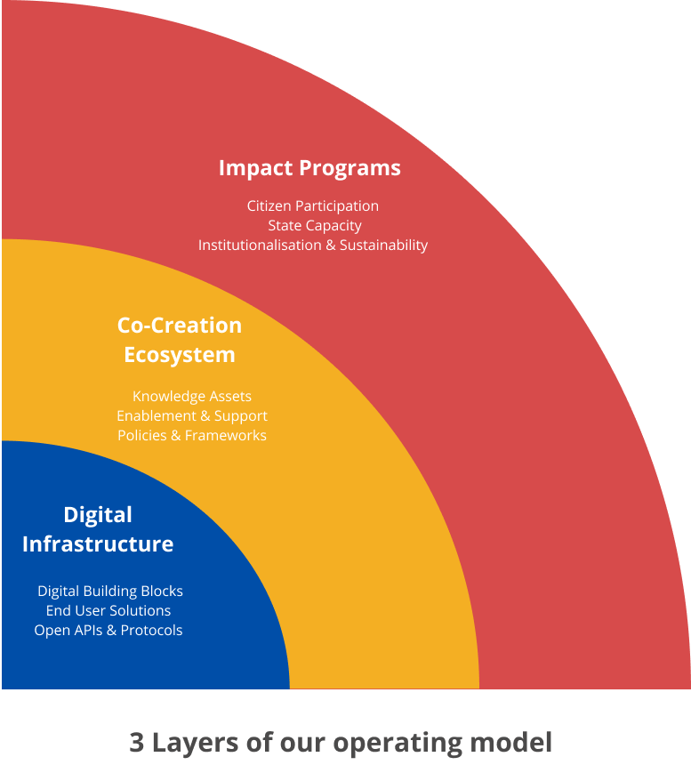

# Mission - Envisioning new way of Sanitation

**Vision- Zero deaths, disease, and environmental contamination resulting from poor sanitation**\
_****_

The Sanitation Mission at eGov aims to make this vision a reality for every citizen across India. We believe that the core of the sanitation problem is that current systems fail to deliver against this vision and hence the system itself needs to be progressively reformed to achieve this vision.

#### Why Now? - A renewed focus on Health and Sanitation

There is high energy in the sanitation ecosystem right now, which has received positive attention in line with the renewed government focus on health in face of the COVID-19 pandemic. In Budget 2021, Health & Wellbeing was clearly the most important focus among the six pillars of the Budget outlined by the finance minister. She announced ₹2.83 lakh crore for the health and wellness sector, an increase of 137% over last year. Similar developments were seen for the sanitation sector such as the announcement of dedicated funding to SBM Urban - 2.0 with a clear focus on complete FSSM in the SBM-Urban and dedicated funding of ₹ 1.41 lakh crore. The development of national and state-level sanitation policies and programs. With over 700+ Faecal Sludge Treatment Plants (FSTPs) being committed, (of which 220 are under construction and 150 are operational), along with commitments from states towards the construction of FSTPs, sanitation has achieved a definitive momentum.

#### Why us? - Impact at Scale and Speed

The problems of sanitation are systemic in nature, and cannot be solved without the cooperation, coordination, and collaboration of all stakeholders. Such a problem, catalyzing the triple helix model (samaaj, sarkaar, and bazaar), lends itself effectively to digital intervention based on the construct of the societal platform and ecosystem orchestration drawing from our learnings in the urban mission. Given our experience in building public digital infrastructure at scale, we believe we are best placed to create the foundation of this infrastructure and catalyze the ecosystem to progressively solve the most pressing issues and co-create further versions of the digital infrastructure.

Our operating model approach manifests in :

* The platform approach to digital development frees up resources to focus on critical non-technology elements of the sector like creating enabling policy frameworks, change management, capacity building and institutionalization. A shared digital infrastructure approach makes the digital building blocks available to the entire ecosystem, thus, reducing the overall expenditure needed on the technology development side for individual solutions.
* Platforms enable ecosystem actors to develop contextual ‘local’ innovations at speed and scale, thereby accelerating the rate of adoption and proliferation of innovations in the FSM space. This is critical to address challenges in FSM for service delivery and performance management.
* Once the first instance of shared digital infrastructure is created, the digital building blocks become available to the entire ecosystem as open-source. This results in ease of on-boarding for more states and ULBs which aids the rapid expansion of the Infrastructure across geographies.
* Platforms empower ecosystem actors through data by providing access to trusted data in a timely manner at a systemic level. They facilitate data discovery and sharing between disparate urban systems using open standards and APIs. For the sanitation sector, this creates a shared source of truth for all stakeholders to collaborate in problem definition, decision making and shape the growth of the sector based on unified data.
* The opportunity to seed a fundamental shift in the sanitation landscape by demonstrating a radically new approach to digital interventions in sanitation and creating the digital infrastructure that can be useful for FSM work worldview

\
Given the co-creation, scaling, and interoperability potential of platforms, this approach will enable the sanitation sector to transform itself from a top-down control function to one that enables higher state capacity in areas of core concerns. When seen in consonance with key Government of India moves in creating digital infrastructures in various domains including urban development, payments, health, education, skill development amongst others, as well as the issuance of a strategy on National Open Digital Ecosystems (NODEs), a sanitation platform will be a crucial part of the emerging “governance stack”. Moving forward, the mission will be enabled by critical government policies supporting the adoption of platforms like MeitY’s Strategy on National Open Digital Ecosystems (NODE), India Enterprise Architecture (IndEA), and the National Data Sharing and Accessibility Policy (NDSAP), which are a driving force to create the Shared Digital Infrastructure for the ecosystem.
