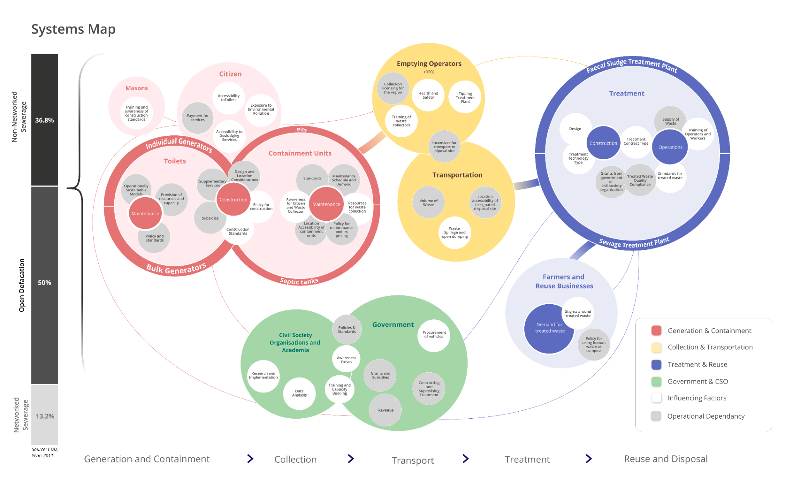
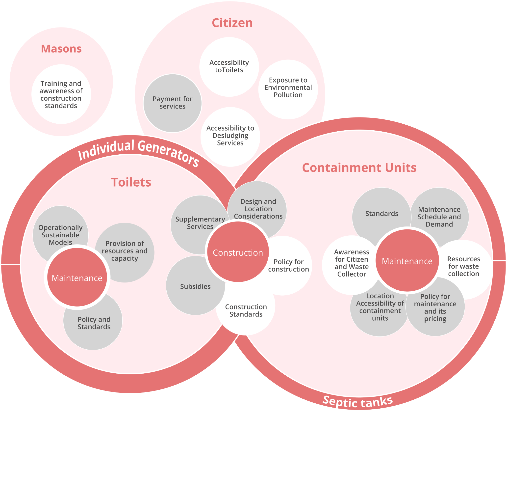
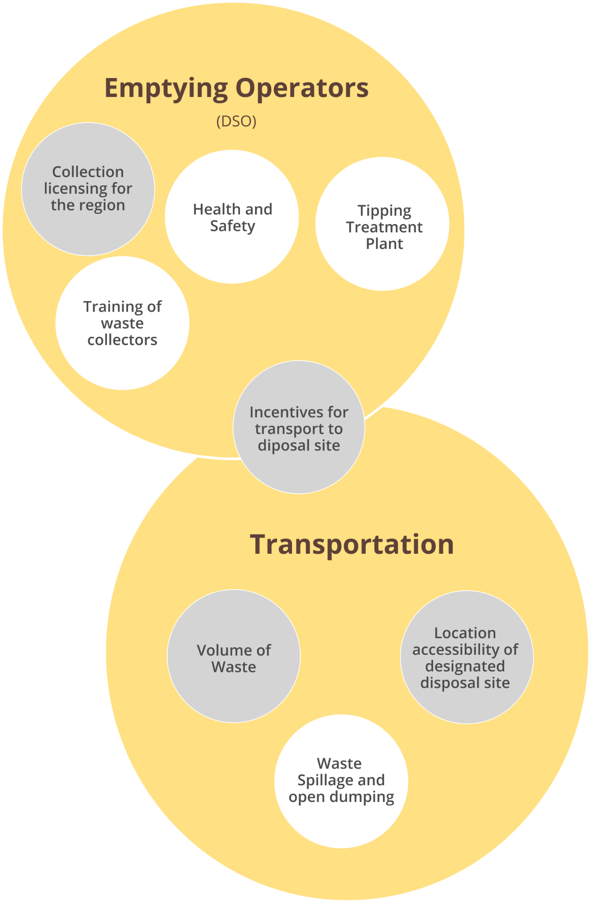
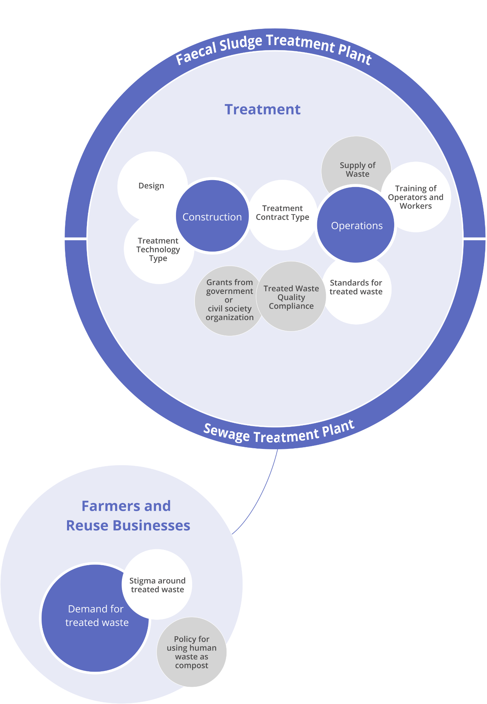
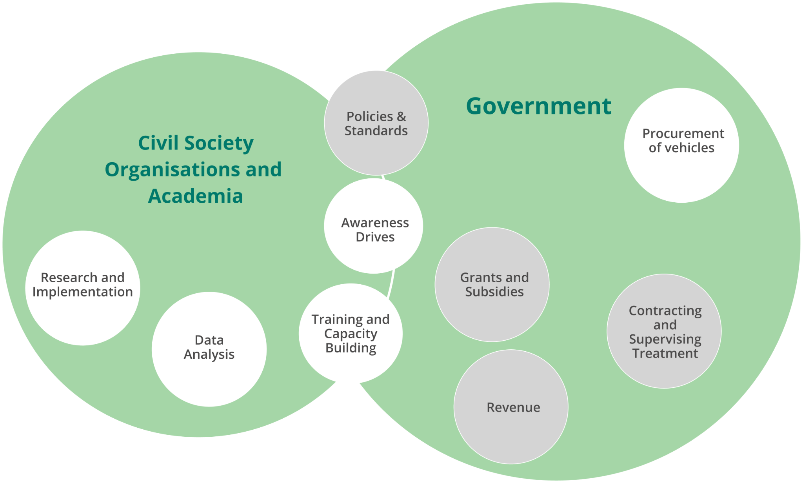

# FSSM - a complex system

Our current awareness and understanding of the problems in septage management are based on our interactions with ecosystem leaders and leading reports, whitepapers, and published materials. We are deeply aware that FSSM systems have highly interdependent parts. Each stage of the FSSM value chain impacts how effectively the next stage functions.

For instance, if the septic tanks do not have proper access, they will add to the cost of emptying, adding a time cost burden on the desludging operators (DSOs). Similarly, it becomes unviable for the DSOs to dump the waste at the treatment plant if it is far from the city which is often the case. Treatment plants are located as per administrative or financial concerns; locations where public land is available or where surroundings do not have residences. This shows how merely one factor can impact the final sanitation outcome if not considered comprehensively. If the location is not conducive for DSOs to supply the waste to the plant or the time and distance are not factored into the cost, it will remain profitable to dump the waste in the open and go for the next service. The delivery of safe sanitation requires the infrastructure and services to work in tune with each other. Calibration in the different parts of the value chain is critical to achieving functional sanitation systems.

While the linear sanitation value chain gives a lucid frame to understand the ideal flow of FS, it doesn’t capture the variety of stakeholders in the interactions that control and influence the current effectiveness of sanitation systems.

In the following section, we use a systems mapping approach to delineate the various factors and interactions within the sanitation value chain. We will explore various systemic challenges at each part of the value chain which finally culminate into the poor sanitation outcomes.

[Reference Link](https://www.figma.com/proto/MUvgUB6mtfNMFtPEXmmiYx/Lo-Fi-Sanitation?node-id=1245%3A5139\&scaling=contain\&page-id=1074%3A27)

Part 1 - Toilets and Containment Units

City Managers, Centre/State Govt

While Sanitation has been a clear priority for the Centre and State Governments, city administrators have been strapped due to deficiencies in standards, building codes, municipal processes, and contracting and monitoring capabilities which makes it difficult to ensure the adequacy, usability, and safety of the toilets provisioned by public funds.\

**Masons**

The role of masons is fundamental in proper construction of toilets and containment units. Currently, a majority of masons [lack the necessary training](https://iihs.co.in/knowledge-gateway/wp-content/uploads/2021/03/Training-Needs-Assesments-Mason-01-september-2020.pdf) on construction standards. They are rarely employed using formal contracts which contributes to the lack of traceability and accountability when it comes to the construction of toilets.\

Citizens

There is a general concern among citizens about their health and pollution of the environment, but they are unaware of the impacts of improper construction of toilets and containment tanks. Owing to this lack of awareness or constraints of affordability and space, citizens influence the masons to construct containment units that do not follow the technical standards. It is difficult to identify trained masons and the procurement of service happens through offline social networks and word of mouth.

**Part 2 - Emptying and Transport**

Desludging Operators (DSOs):

* Lack of proper access to the containment systems adds time-cost to service.
* Treatment plants are located far from the city which makes safe dumping unviable.
* While the payment from citizens is a clear incentive for emptying the tanks or pits there are no such incentives that ensure the safe transport of the faecal sludge to the treatment plant.
* Operations remain inefficient without timely and useful information for service delivery (location, house width, tentative volume).
* The working conditions are highly risky, provisions for personal protection equipment and emergency healthcare services are rare and sparse.

\
Citizens:

* It is difficult to identify and book desludging services and service delivery is not reliable.
* Low-income households are denied service since they are not able to afford the full cost.

City Managers, Centre/State Govt:

* Difficult to regulate the market for safe dumping without compromising service delivery.
* There is no clear and actionable information in terms of safe or unsafe dumping of FS.
* Lack of necessary pricing policies, service, and infra standards, licensing processes, and contracting and monitoring capacity limit the ability of decision-makers to take action.

**Part 3 - Treatment**

City Managers, Centre/State Govt:\

* Difficult to regulate the market for across various stages of construction and operations
* Operational data of the treatment plant and process is often recorded offline and used for post-facto auditing. There is a pervasive lack of actionable information.
* Lack of rational pricing policies, comprehensive service benchmarks and infrastructure standards, contracting and monitoring tools hamper corrective action.

\
Plant Operators:

* The supply of desludging load varies in an unreliable and unpredictable manner. This variance shocks in the treatment capacity, short-circuits the treatment process, and over a long term leads to the failure of the system.\

* Treatment plant management and maintenance is difficult and costly, the payments are often not linked to performance. The performance is not directly causally linked to the environmental impact.
* Operations are not monitored to facilitate preventive action within the plant, and lack any binding linkages with standard operating procedures and service level agreements.

Part 4 - Ecosystem

Civil Society and Academia

* Researchers struggle without the availability of systemic data to create new knowledge around the failures, risks, and opportunities to give recommendations for improvement.
* Since policy and standards are not mapped to operational data, it is difficult for the ecosystem to translate knowledge to action to impact and access.

\
Government:\

* Inability to trace the impact and proper usage of grants and subsidies for sanitation
* Limited state capacity in terms of budget, skilled human resources, tools, and technology render sanitation a highly complex problem for sanitation departments
* Coordination across multiple functions is needed to keep sanitation systems functional: standard-setting, policy-making, contracting, audit, monitoring among many others
* Limited penetration of technology, innovation, and competition in the sanitation sector, without transparency it remains difficult for the government to enforce accountability across internal processes and market interactions
