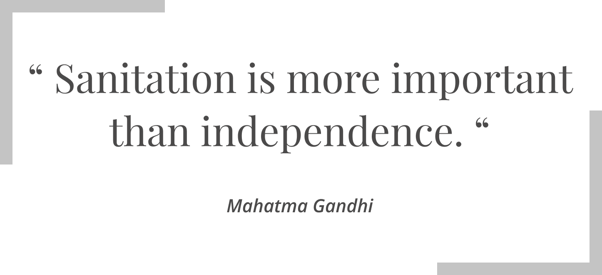
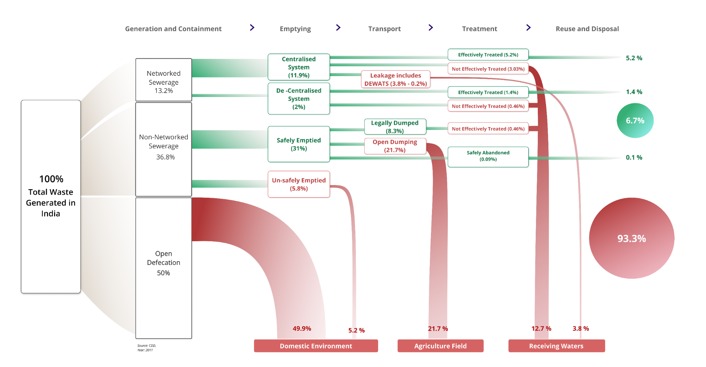
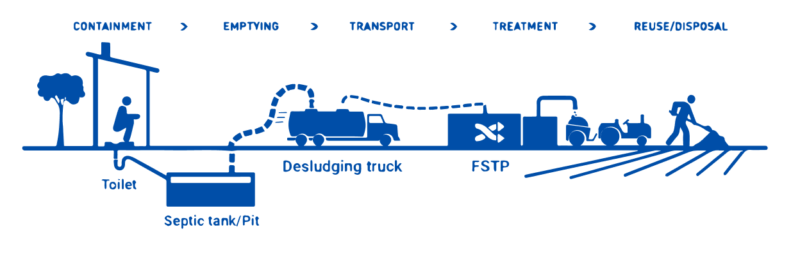
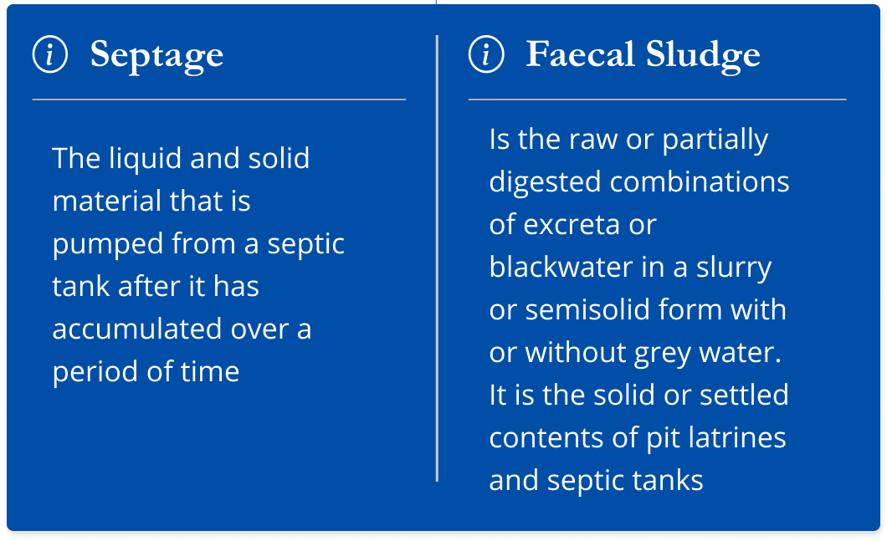
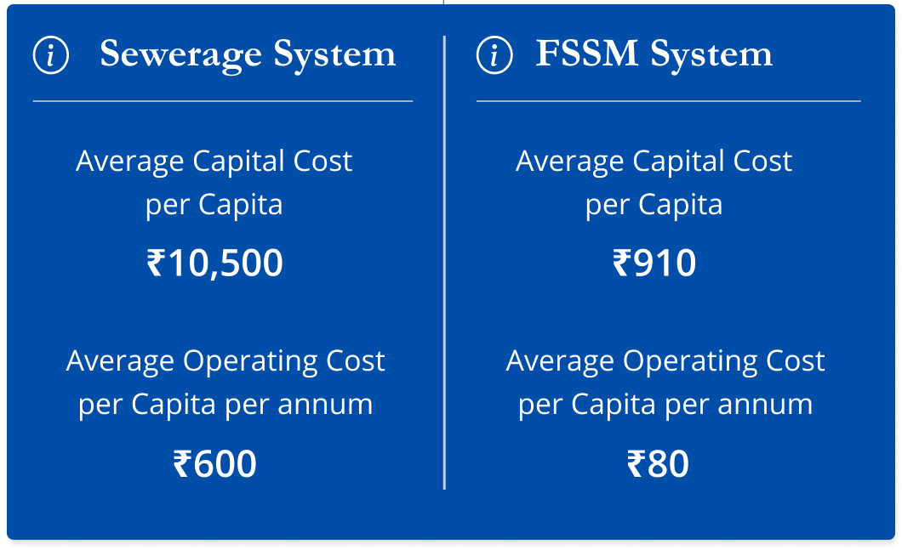
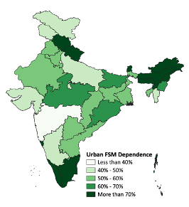

# Background and Landscape

### What is Sanitation?

National Urban Sanitation Policy (NUSP, 2008) defines Sanitation as “safe management of human excreta, including safe confinement treatment, disposal, and associated hygiene-related practices”. While the policy pertains to human excreta, it recognizes that integral solutions need to take account of other elements of environmental sanitation, i.e. solid waste management; generation of industrial and other hazardous wastes; drainage; as also the management of drinking water supply.\[[1](http://mohua.gov.in/upload/uploadfiles/files/NUSP\_0.pdf)]

### Why Sanitation Matters? 

_“_Everyone has the right to life, liberty, and security of person”; Article 21: the fundamental right to life in the Indian constitution embodies the same spirit as the Universal Declaration of Human Rights. If life and the prospect of a healthy and secure life is actually a right of every human being, then lack of safe sanitation is a barrier in achieving this goal. Every year three lakh Indian children die due to Diarrhoea, a preventable disease that happens due to contamination in food and water\[[1](https://www.ncbi.nlm.nih.gov/pmc/articles/PMC4367049/#ref2)]. The same disease is behind the stunted growth of 4 crore Indian children\[[2](https://www.unicef.org/india/what-we-do/stop-stunting)]. A lack of safe sanitation is attributed as a major cause of both, Diarrhoea and Stunting. Poor sanitation denies our fellow citizens the right to clean drinking water. Around 80% of India’s water is severely polluted because people dump raw sewage, silt, and garbage into the country’s rivers and lakes. The water is undrinkable and people rely on illegal and expensive sources of water. [\[3\]](https://www.borgenmagazine.com/water-pollution-in-india/) While our constitution embraces that “All human beings are born free and equal in dignity and rights”, poor sanitation disproportionately impacts vulnerable communities.

A John Hopkins Study \[[3](https://papers.ssrn.com/sol3/papers.cfm?abstract_id=2753358)] highlights that the deficits in sanitation and the health burden on children is higher in more vulnerable slums. More than a third of households in the lowest income category lack access to any form of safe sanitation\[[4](https://journals.sagepub.com/doi/full/10.1177/0956247814567058)], and it is not just the case at home. In public institutions, especially in schools, the lack of sanitation facilities burdens the girl child disproportionately once menstrual hygiene becomes a daily concern.\[[5](https://www.downtoearth.org.in/blog/health/23-girls-drop-out-of-school-on-reaching-puberty-59496)].

The other key problem is working conditions and safety of sanitation workers According to the numbers collated by the National Commission for Safai Karamcharis (NCSK)\[[6](https://indianexpress.com/article/india/official-data-shows-one-manual-scavenging-death-every-five-days-5361531/)], a sanitation worker dies every five days, on the job, cleaning sewers and septic tanks across the country. Article 5 of the universal declaration of human rights reads that “No one shall be subjected to torture or to cruel, inhuman or degrading treatment or punishment”, but the constant threat of death mark the life of sanitation workers who work under inhuman and unsafe conditions without personal protection or medical support. Forced by abject poverty and social exclusion, they have no other choice. The ground realities of Sanitation in India force us to examine our respect and concern for human life and dignity. It is no wonder that the man who devoted his entire life to independence, held Sanitation as more important.

### Current State of Sanitation Systems in India

The Ministry of Environment, Forest, and Climate Change defines hazardous waste as any waste which due to its physical, chemical, or biological composition is likely to harm health or the environment. By this definition, Human fecal matter is extremely hazardous, the evidence speaks for itself. The high volume and frequency of faecal matter generation, when seen against the current performance of our sanitation system, highlight the urgency of the issue. India ranks 107 out of 143 countries in terms of wastewater treatment according to the estimates of Yale University. [\[7\]](https://epi.yale.edu/epi-indicator-report/WWT)

According to gross estimates of the Indian Central Pollution Control Board, our cities generate 72.4 billion litres of sewage every day, of which only 20 billion is treated. It means that every single day, 52.2 billion litres of raw, untreated sewage goes out into the environment.[\[8\]](https://cpcb.nic.in/openpdffile.php?id=UmVwb3J0RmlsZXMvMTIyOF8xNjE1MTk2MzIyX21lZGlhcGhvdG85NTY0LnBkZg==) The sewage leeches into the soil, contaminates food and groundwater, causing pollution and deaths.

F most of the toilets in the country are not connected to an underground sewage network. Only 50% of the population used toilets in 2011, and 75% of these toilets were connected to an on-site pit or septic tank where the fecal matter remains contained for 3 to 5 years. These on-site systems are not properly managed, close to 70% of fecal matter ends up contaminating the environment due to poor construction and/or disposal practices. An analysis of Census 2011 shows that overall 93% of faecal matter entered the environment without treatment.

### What is FSSM?

\

The waste we flush down the toilet does not always go into a sewer. Approximately 70% of the households in India have toilets connected to septic tanks or soak pits[\[8\]](https://smartnet.niua.org/sites/default/files/resources/feacal_sludge_menagement_leaf.pdf) , technically known as on-site containment systems. They accumulate and store faecal matter over a long period. In sewers, the fecal matter travels daily with a lot of water through long concrete pipes. But in the case of on-site systems, it stays stored for about 3-5 years. Once the storage is full, the waste is emptied and transported to the treatment plant through vacuum trucks. The end-to-end value chain of safe storage, collection, transport, treatment, and end-use or disposal of faecal matter is called Fecal Sludge and Septage management or FSSM. ‘Faecal Sludge’ and ’Septage’ are used to describe faecal matter in a specific physical and chemical\
state after prolonged storage.

### Why does FSSM matter - It is the way forward in Sanitation

\
FSSM has emerged as a cost-efficient population scale alternative to the networked sewer, which has been the traditional method of wastewater management.\

1. **Cost-effective: **10 times cheaper than sewer systems. Given the fiscal space for sanitation, FSSM becomes a default method for delivering safe sanitation for all.
2. **Coverage:** Less than one-third of urban toilet users are connected to sewer systems. The rest are more or less dependent on FSSM systems. Targeting FSSM will help us impact the maximum number of citizens.
3. **Scale:** In the Swachh Bharat Mission, GoI zeroed down on Open Defecation and constructed 11 crore toilets across the country, most of which are connected to on-site systems, again increasing the need for FSSM.
4. **Policy tail-winds:** From 2013 to 2021, the Government of India has shown consistent commitment evidenced to Sanitation. Over these years, state governments and union ministries have deeply engaged with domain experts to create several policy enablers in order to accelerate the progress of Sanitation outcomes. With the launch of the Swachh Bharat Mission in 2013, Sanitation came to the forefront of multiple policy interventions including dedicated funding for toilet construction, the proliferation of standards, service-level benchmarks, and Swacchh Survekshan. This was followed by a pivot to a clear focus on FSSM and the importance of interventions across the value chain. The release of the National FSSM Policy in 2017, with further funding allocation across various missions and grants including ([AMRUT](http://amrut.gov.in/content/), SBM, NMCG, 15th Finance Commission), culminating into SBM 2.0 with a clear focus on complete FSSM in the SBM-Urban and funding of 1.41Lakh Crore INR in the budget 2020-21. The States have created momentum with over 700+ Faecal Sludge Treatment Plants (FSTPs) being committed, of which 220 are under construction (with 150 operational plants).

In the next ten years, FSSM will be further mainstreamed in 19 out of 36 states and union territories which cover more than 85% of the Indian population. These states and UTs have followed suit and created state-specific FSSM guidelines and regulatory frameworks to demarcate responsibilities between various bodies at the state and the local level, laying the groundwork for synergizing different schemes to ensure affordable, appropriate, & sustainable FSSM across the state.

By 2030, FSM to serve sanitation needs of 52% of total urban population or \~290mn

1. Market Growth: According to the Toilet Board Coalition (FICCI, Tata Trust, USAID, ADB, etc), the market opportunity of the sanitation economy is at 7.2 Lakh Crore INR in 2021 and will grow to 11 Lakh Crore by 2030.[\[9](http://www.toiletboard.org/wp-content/uploads/2021/03/2020-Sanitation-Economy-Markets-India.pdf)[\]](http://www.toiletboard.org/wp-content/uploads/2021/03/2020-Sanitation-Economy-Markets-India.pdf) As huge as it is, this number only estimates the market for provision, and operations, and maintenance of toilets which is only the first part of the value chain in FSSM. Currently, citizen-facing services such as construction and emptying of pits and septic tanks are fulfilled by the informal sector. The role of these businesses will be critical to the delivery of safe and sustainable sanitation in the future.\

2. Virtuous ecosystem: Compared to the rest of sanitation, FSSM is still a nascent field and malevolent actors such as the [waste mafia](https://www.deccanherald.com/opinion/first-edit/remove-garbage-and-the-mafia-760787.html) are not as prevalent or embedded. It is also a smaller ecosystem to orchestrate, and we are already aligned with the ecosystem leaders such as Bill and Melinda Gates Foundation, Centre for Policy Research, WASH Institute, and several key actors in the National FSSM Alliance.
